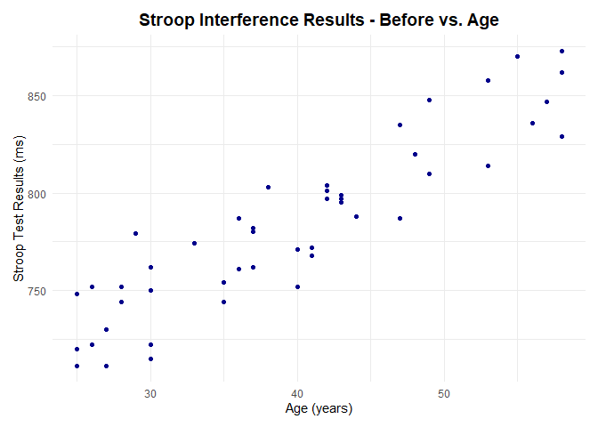
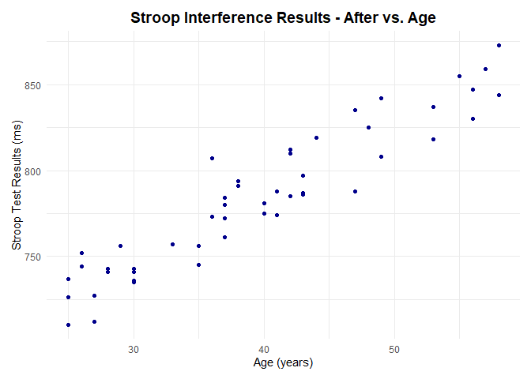
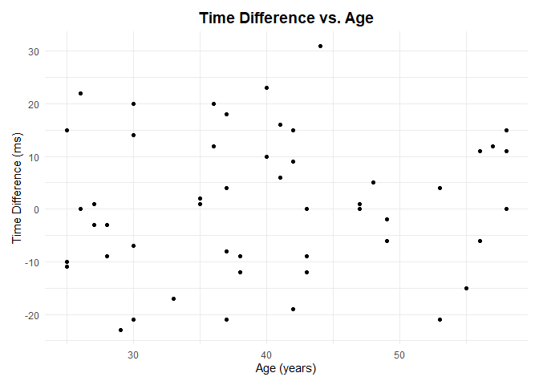
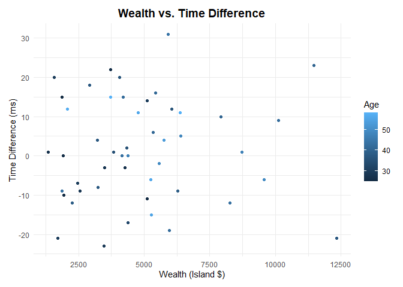
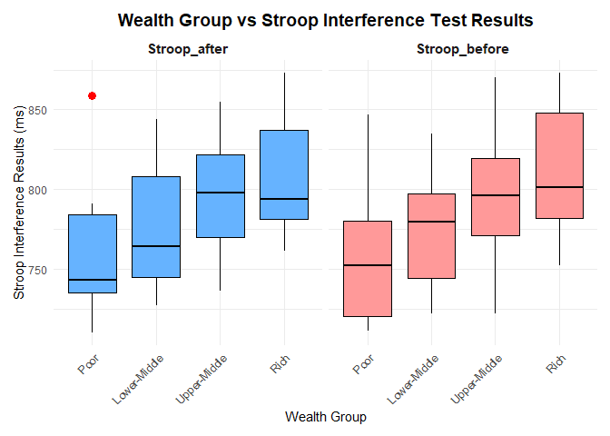
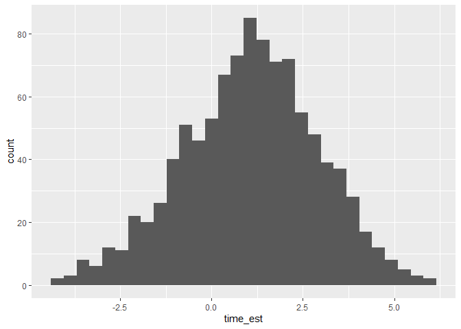
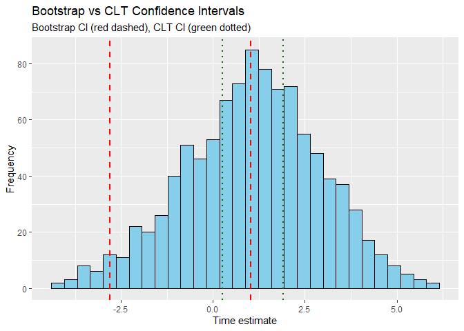
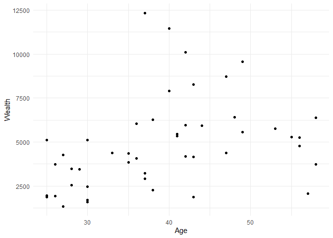
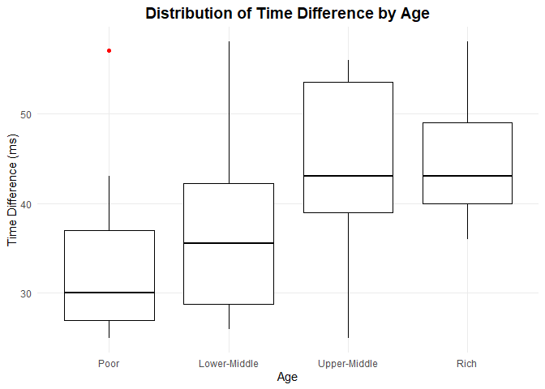
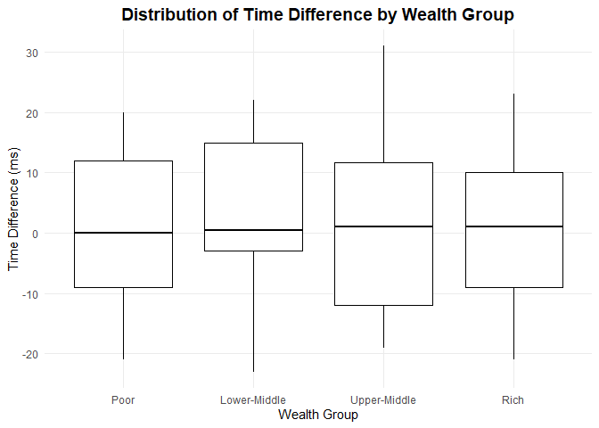

Data Science Final Project
================
Ariel Chen and Allyson Hur
2025-04-26

``` r
library(tidyverse)
```

    ## ── Attaching core tidyverse packages ──────────────────────── tidyverse 2.0.0 ──
    ## ✔ dplyr     1.1.4     ✔ readr     2.1.5
    ## ✔ forcats   1.0.0     ✔ stringr   1.5.1
    ## ✔ ggplot2   3.5.1     ✔ tibble    3.2.1
    ## ✔ lubridate 1.9.4     ✔ tidyr     1.3.1
    ## ✔ purrr     1.0.2     
    ## ── Conflicts ────────────────────────────────────────── tidyverse_conflicts() ──
    ## ✖ dplyr::filter() masks stats::filter()
    ## ✖ dplyr::lag()    masks stats::lag()
    ## ℹ Use the conflicted package (<http://conflicted.r-lib.org/>) to force all conflicts to become errors

``` r
library(rsample)
library(dplyr)
```

``` r
df <- read_csv("./data/monincentive.csv") %>% 
  glimpse() 
```

    ## Rows: 50 Columns: 6
    ## ── Column specification ────────────────────────────────────────────────────────
    ## Delimiter: ","
    ## chr (1): Name
    ## dbl (4): Age, Stroop Interference (ms)-before, Stroop Interference (ms)-afte...
    ## num (1): Current Wealth
    ## 
    ## ℹ Use `spec()` to retrieve the full column specification for this data.
    ## ℹ Specify the column types or set `show_col_types = FALSE` to quiet this message.

    ## Rows: 50
    ## Columns: 6
    ## $ Name                              <chr> "Mathilde Lebrun", "Lord Desmond Yam…
    ## $ `Current Wealth`                  <dbl> 5113, 4771751, 6271, 6042, 5331, 226…
    ## $ Age                               <dbl> 30, 53, 38, 36, 41, 38, 30, 42, 44, …
    ## $ `Stroop Interference (ms)-before` <dbl> 722, 858, 803, 761, 768, 803, 762, 8…
    ## $ `Stroop Interference (ms)-after`  <dbl> 736, 837, 794, 773, 774, 791, 741, 7…
    ## $ `Time Difference`                 <dbl> 14, -21, -9, 12, 6, -12, -21, -19, 3…

``` r
df %>% summary()
```

    ##      Name           Current Wealth         Age      
    ##  Length:50          Min.   :   1346   Min.   :25.0  
    ##  Class :character   1st Qu.:   3226   1st Qu.:30.0  
    ##  Mode  :character   Median :   4380   Median :39.0  
    ##                     Mean   : 199280   Mean   :39.8  
    ##                     3rd Qu.:   6020   3rd Qu.:47.0  
    ##                     Max.   :4960316   Max.   :58.0  
    ##  Stroop Interference (ms)-before Stroop Interference (ms)-after
    ##  Min.   :711.0                   Min.   :710.0                 
    ##  1st Qu.:752.0                   1st Qu.:746.8                 
    ##  Median :781.0                   Median :784.5                 
    ##  Mean   :784.3                   Mean   :785.4                 
    ##  3rd Qu.:808.5                   3rd Qu.:816.5                 
    ##  Max.   :873.0                   Max.   :873.0                 
    ##  Time Difference 
    ##  Min.   :-23.00  
    ##  1st Qu.: -9.00  
    ##  Median :  0.50  
    ##  Mean   :  1.08  
    ##  3rd Qu.: 11.75  
    ##  Max.   : 31.00

``` r
df_clean <- df %>%
  rename(
    Stroop_before = `Stroop Interference (ms)-before`,
    Stroop_after = `Stroop Interference (ms)-after`,
    Time_diff = `Time Difference`,
    Wealth = `Current Wealth`,
  )
```

``` r
df_clean %>% 
  ggplot(aes(x = Age, y = Stroop_before)) +
  geom_point(color = "darkblue") +
  theme_minimal() +
  labs(title = "Stroop Interference Results - Before vs. Age",
       x = "Age (years)", y = "Stroop Test Results (ms)") +
  theme( 
    plot.title = element_text(size = 14, face = "bold", hjust = 0.5),
    )+
  theme(
    plot.margin = margin(10, 10, 10, 10)  # Margins around the plot
  )
```

<!-- -->

``` r
df_clean %>% 
  ggplot(aes(x = Age, y = Stroop_after)) +
  geom_point(color = "darkblue") +
  theme_minimal() +
  labs(title = "Stroop Interference Results - After vs. Age",
       x = "Age (years)", y = "Stroop Test Results (ms)") +
  theme( 
    plot.title = element_text(size = 14, face = "bold", hjust = 0.5),
    )+
  theme(
    plot.margin = margin(10, 10, 10, 10)  # Margins around the plot
  )
```

<!-- -->

``` r
df_clean %>% 
  ggplot(aes(x = Age, y = Time_diff)) +
  geom_point() +
  theme_minimal() +
  labs(title = "Time Difference vs. Age",
       x = "Age (years)", y = "Time Difference (ms)") +
  theme( 
    plot.title = element_text(size = 14, face = "bold", hjust = 0.5),
    )+
  theme(
    plot.margin = margin(10, 10, 10, 10)  # Margins around the plot
  )
```

<!-- -->

``` r
df_no_outliers = df_clean[-c(2, 38), ]
df_no_outliers %>% 
  ggplot(aes(x = Wealth, y = Time_diff, colour = Age)) +
  geom_point() +
  labs(title = "Wealth vs. Time Difference",
       x = "Wealth (Island $)", y = "Time Difference (ms)") +
  theme_minimal() +
  theme( 
    plot.title = element_text(size = 14, face = "bold", hjust = 0.5),
    )+
  theme(
    plot.margin = margin(10, 10, 10, 10)  # Margins around the plot
  )
```

<!-- -->

``` r
quantiles <- quantile(df_clean$Wealth, probs = c(0.25, 0.5, 0.75))

df_long <- df_clean %>%
  pivot_longer(
    cols = c(Stroop_before, Stroop_after),
    names_to = "Time",
    values_to = "Stroop_Interference"
  ) %>% 
  mutate(
    Wealth_group = case_when(
      Wealth >= quantiles[3] ~ "Rich",            # Greater than 75th percentile
      Wealth >= quantiles[2] & Wealth < quantiles[3] ~ "Upper-Middle",  # Between 50th and 75th percentile
      Wealth >= quantiles[1] & Wealth < quantiles[2] ~ "Lower-Middle",  # Between 25th and 50th percentile
      Wealth < quantiles[1] ~ "Poor"              # Less than 25th percentile
    ),
    Wealth_group = factor(
      Wealth_group,
      levels = c("Poor", "Lower-Middle", "Upper-Middle", "Rich")
    )
  )

df_long %>%
  ggplot(aes(x = Wealth_group, y = Stroop_Interference, fill = Time)) +
  geom_boxplot(
    color = "black",  # Box color for better contrast
    outlier.shape = 16,  # Style outliers with circles
    outlier.size = 3,  # Adjust outlier size
    outlier.colour = "red"  # Color outliers in red
  ) +
  facet_wrap(~ Time) +  # Facet based on Time (before vs after)
  scale_fill_manual(values = c("Stroop_before" = "#FF9999", "Stroop_after" = "#66B3FF")) +  # Custom colors for before and after
  theme_minimal() +  # Minimal theme with larger text
  theme(
    axis.text.x = element_text(angle = 45, hjust = 1),  # Rotate x-axis labels for readability
    plot.title = element_text(size = 14, face = "bold", hjust = 0.5),  # Title styling
    strip.text = element_text(size = 11, face = "bold"),  # Facet label styling
    legend.position = "none",  # Hide legend (redundant with x-axis labels)
    plot.margin = margin(10, 10, 10, 10)  # Add margins around the plot
  ) +
  labs(
    title = "Wealth Group vs Stroop Interference Test Results",
    x = "Wealth Group",
    y = "Stroop Interference Results (ms)"
  )
```

<!-- -->

``` r
df_bootstrap_sim <- 
  df_clean %>% 
  bootstraps(., times = 1000) %>% 
  mutate(
    time_est = map_dbl(
      splits,
      function(split_df) {
        analysis(split_df) %>% 
          # Estimate pi (pi_est) using the resampled data;
          # this should be *identical* to the
          # code you wrote for q3
            # mutate(time_est = mean(Time_diff)) %>%
            summarize(time_est = mean(Time_diff)) %>%
          pull(time_est)
      }
    )
  )

## NOTE: Do not edit; use this to visualize your results
df_bootstrap_sim %>% 
  ggplot(aes(time_est)) +
  geom_histogram()
```

    ## `stat_bin()` using `bins = 30`. Pick better value with `binwidth`.

<!-- -->

``` r
df_bootstrap <- df_bootstrap_sim %>% 
  summarize(
    mean_time = mean(time_est),
    time_lo = quantile(time_est, 0.05 / 2),
    time_up = quantile(time_est, (1 - 0.05) / 2),
  )

df_bootstrap
```

    ## # A tibble: 1 × 3
    ##   mean_time time_lo time_up
    ##       <dbl>   <dbl>   <dbl>
    ## 1      1.05   -2.84   0.970

``` r
df_clt_ci <- df_clean %>%
  summarize(
    mean_time = mean(Time_diff),          # Mean of the sample
    sd_time = sd(Time_diff),               # Standard deviation of the sample
  ) %>%
  mutate(
    se = sd_time / sqrt(1000),                          # Standard error
    time_lo = mean_time - qnorm(0.975) * se,          # 95% CI lower bound
    time_up = mean_time + qnorm(0.975) * se           # 95% CI upper bound
  )

df_clt_ci
```

    ## # A tibble: 1 × 5
    ##   mean_time sd_time    se time_lo time_up
    ##       <dbl>   <dbl> <dbl>   <dbl>   <dbl>
    ## 1      1.08    13.3 0.420   0.256    1.90

``` r
df_bootstrap_sim %>%
  ggplot(aes(x = time_est)) +
  geom_histogram(bins = 30, fill = "skyblue", color = "black") +
  geom_vline(data = df_bootstrap, aes(xintercept = time_lo), color = "red", linetype = "dashed", size = 1) +
  geom_vline(data = df_bootstrap, aes(xintercept = time_up), color = "red", linetype = "dashed", size = 1) +
  geom_vline(data = df_clt_ci, aes(xintercept = time_lo), color = "darkgreen", linetype = "dotted", size = 1) +
  geom_vline(data = df_clt_ci, aes(xintercept = time_up), color = "darkgreen", linetype = "dotted", size = 1) +
  labs(title = "Bootstrap vs CLT Confidence Intervals",
       subtitle = "Bootstrap CI (red dashed), CLT CI (green dotted)",
       x = "Time estimate",
       y = "Frequency")
```

    ## Warning: Using `size` aesthetic for lines was deprecated in ggplot2 3.4.0.
    ## ℹ Please use `linewidth` instead.
    ## This warning is displayed once every 8 hours.
    ## Call `lifecycle::last_lifecycle_warnings()` to see where this warning was
    ## generated.

<!-- -->

``` r
df_no_outliers %>% 
  ggplot(aes(x=Age, y=Wealth)) +
  geom_point() +
  theme_minimal()
```

<!-- -->

``` r
df_long %>%
  ggplot(aes(x = Wealth_group, y = Age)) +
  geom_boxplot(
    color = "black",  # Box color
    outlier.shape = 16,  # Style outliers
    outlier.size = 1.5,  # Outlier size
    outlier.colour = "red"  # Outlier color
  ) +
  theme_minimal() +  # Minimal theme with larger text size
  labs(
    title = "Distribution of Time Difference by Age",
    x = "Age", 
    y = "Time Difference (ms)"
  ) +
  theme(
    plot.title = element_text(size = 14, face = "bold", hjust = 0.5),  # Title styling
    panel.grid.minor = element_blank(),  # Remove minor gridlines
    legend.position = "none"  # Hide legend (since it's redundant with the x-axis labels)
  ) 
```

<!-- -->

``` r
df_long %>% 
  ggplot(aes(x = Wealth_group, y = Time_diff)) +
  geom_boxplot(,  # Add color based on wealth group
    color = "black",  # Box color
    outlier.shape = 16,  # Style outliers
    outlier.size = 3,  # Outlier size
    outlier.colour = "red"  # Outlier color
  ) +
  theme_minimal() +  # Minimal theme with larger text size
  labs(
    title = "Distribution of Time Difference by Wealth Group",
    x = "Wealth Group", 
    y = "Time Difference (ms)"
  ) +
  theme(
    plot.title = element_text(size = 14, face = "bold", hjust = 0.5),  # Title styling
    panel.grid.minor = element_blank(),  # Remove minor gridlines
    legend.position = "none"  # Hide legend (since it's redundant with the x-axis labels)
  ) 
```

<!-- -->
