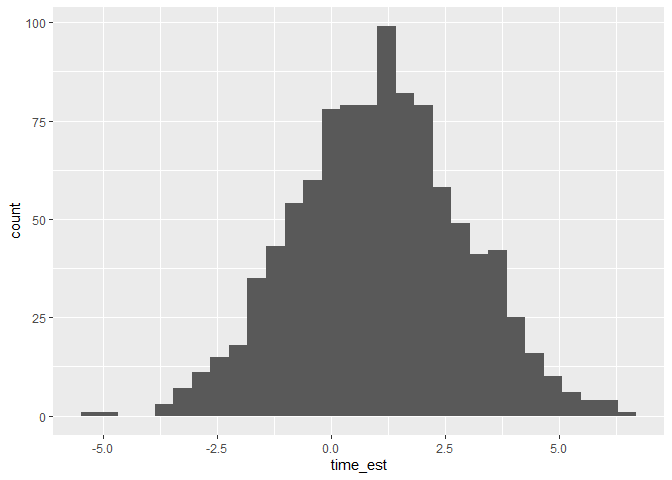

Data Science Final Project
================
Ariel Chen and Allyson Hur
2025-04-26

- [The Role of Wealth in Shaping the Effectiveness of Monetary
  Incentives on Cognitive
  Performance](#the-role-of-wealth-in-shaping-the-effectiveness-of-monetary-incentives-on-cognitive-performance)
  - [**BACKGROUND**](#background)
  - [**Central Hypothesis**](#central-hypothesis)
  - [**Experiment**](#experiment)
  - [**Test subjects**](#test-subjects)
  - [**Procedure**](#procedure)
  - [**Observations**](#observations)
  - [**Observations**](#observations-1)
  - [**Observations**](#observations-2)
  - [**Observations**](#observations-3)
  - [**Results & Conclusions**](#results--conclusions)

# The Role of Wealth in Shaping the Effectiveness of Monetary Incentives on Cognitive Performance

### **BACKGROUND**

At first, we wanted to do a project relating to the “science of
motivation” by Dr. Daniel Pink, using the simulation Islanders. We hoped
to recreate the findings from one of his experiments, where he
demonstrated that while rewards can motivate simple, routine tasks, they
often hinder performance on more complex, creative, or cognitively
demanding tasks—especially when the reward is tied to a specific
outcome. (You can learn more about it here.) However, we ran into a
challenge: we needed a task in the Islanders simulation that actually
required creative thinking or complex cognitive effort. Most of the
tests available are standardized, and the closest match we found was the
“Problem Solving Basic” test (20 minutes). But this test gives numerical
results rather than tracking time to complete, and since it’s labeled
“basic,” we felt it didn’t capture the level of complexity or creativity
needed for the experiment to align well with Dr. Pink’s findings. We
didn’t think our results would be meaningful enough if we proceeded with
it. While exploring this, we realized another interesting angle: in the
Islanders simulation, the monetary incentive is a fixed amount for every
participant. This actually mirrors real-world experiments pretty
realistically. So we shifted our focus: instead of looking at task
complexity, we now want to investigate whether the wealth of an
individual changes their behavior when given a fixed monetary incentive.
Which leads into our central hypothesis below:

### **Central Hypothesis**

Individuals with greater wealth will be less influenced by monetary
incentives in their test performance. In contrast, individuals with less
financial stability will show a greater change in performance when
offered the same fixed amount of monetary incentive.

### **Experiment**

The Islanders simulation conveniently lists each individual’s wealth in
their summary profile. Since our study focuses on wealth, we decided it
was important to select participants across a wide range of financial
statuses. For the test itself, we ultimately chose the Stroop Test
Interference, which measures focus and cognitive control under
conflicting stimuli. After doing some research, we found that the Stroop
Test is highly sensitive to mental effort and is often used in
motivation studies. We also found a relevant paper—“Cueing task goals
and earning money: Relatively high monetary rewards reduce failures to
act on goals in a Stroop
task”(<https://pmc.ncbi.nlm.nih.gov/articles/PMC2890987/>) —which
supports the connection between monetary incentives and Stroop task
performance. One limitation we noticed, however, is that in the
Islanders simulation, the Stroop Test only reports the time taken to
complete the task (in milliseconds) and not the error rates.

### **Test subjects**

At first, we wanted to narrow the geography and age range of our
subjects to 30–40 year-olds from a specific island. We had learned that
minimizing external factors can help reduce noise in data collection and
lead to stronger conclusions. However, we quickly realized that within
that narrow group, there wasn’t much variation in total wealth. To
address this, we expanded the criteria to include individuals aged 25 to
60 years old from all islands. Because we are not comparing participants
against each other, but instead measuring each individual’s performance
before and after receiving a monetary incentive, it made more sense to
prioritize having a wide range of financial statuses rather than
narrowing by other traits. We gathered 50 random individuals from across
the islands using random sampling, by randomly selecting villages and
houses and adding one person max per household as our test subject. To
capture the extremes of the wealth distribution, we also intentionally
included two mayors, who have significantly greater wealth compared to
ordinary citizens. However, we noticed that the city wealth listed
appears to be identical to the mayors’ individual wealth, which raised
some concerns about whether this might be an error in the simulation’s
data or the mayor actually has access to the entirety of the city’s
wealth.

### **Procedure**

1.  We administered the Stroop Test to each subject and recorded their
    performance time.
2.  We provided a monetary incentive of 1,000 island dollars.
3.  After giving the incentive, we administered the Stroop Test a second
    time and recorded their performance again.

``` r
library(tidyverse)
```

    ## ── Attaching core tidyverse packages ──────────────────────── tidyverse 2.0.0 ──
    ## ✔ dplyr     1.1.4     ✔ readr     2.1.5
    ## ✔ forcats   1.0.0     ✔ stringr   1.5.1
    ## ✔ ggplot2   3.5.1     ✔ tibble    3.2.1
    ## ✔ lubridate 1.9.4     ✔ tidyr     1.3.1
    ## ✔ purrr     1.0.2     
    ## ── Conflicts ────────────────────────────────────────── tidyverse_conflicts() ──
    ## ✖ dplyr::filter() masks stats::filter()
    ## ✖ dplyr::lag()    masks stats::lag()
    ## ℹ Use the conflicted package (<http://conflicted.r-lib.org/>) to force all conflicts to become errors

``` r
library(rsample)
library(dplyr)
```

``` r
df <- read_csv("./data/monincentive.csv") %>% 
  glimpse() 
```

    ## Rows: 50 Columns: 6
    ## ── Column specification ────────────────────────────────────────────────────────
    ## Delimiter: ","
    ## chr (1): Name
    ## dbl (4): Age, Stroop Interference (ms)-before, Stroop Interference (ms)-afte...
    ## num (1): Current Wealth
    ## 
    ## ℹ Use `spec()` to retrieve the full column specification for this data.
    ## ℹ Specify the column types or set `show_col_types = FALSE` to quiet this message.

    ## Rows: 50
    ## Columns: 6
    ## $ Name                              <chr> "Mathilde Lebrun", "Lord Desmond Yam…
    ## $ `Current Wealth`                  <dbl> 5113, 4771751, 6271, 6042, 5331, 226…
    ## $ Age                               <dbl> 30, 53, 38, 36, 41, 38, 30, 42, 44, …
    ## $ `Stroop Interference (ms)-before` <dbl> 722, 858, 803, 761, 768, 803, 762, 8…
    ## $ `Stroop Interference (ms)-after`  <dbl> 736, 837, 794, 773, 774, 791, 741, 7…
    ## $ `Time Difference`                 <dbl> 14, -21, -9, 12, 6, -12, -21, -19, 3…

``` r
df %>% summary()
```

    ##      Name           Current Wealth         Age      
    ##  Length:50          Min.   :   1346   Min.   :25.0  
    ##  Class :character   1st Qu.:   3226   1st Qu.:30.0  
    ##  Mode  :character   Median :   4380   Median :39.0  
    ##                     Mean   : 199280   Mean   :39.8  
    ##                     3rd Qu.:   6020   3rd Qu.:47.0  
    ##                     Max.   :4960316   Max.   :58.0  
    ##  Stroop Interference (ms)-before Stroop Interference (ms)-after
    ##  Min.   :711.0                   Min.   :710.0                 
    ##  1st Qu.:752.0                   1st Qu.:746.8                 
    ##  Median :781.0                   Median :784.5                 
    ##  Mean   :784.3                   Mean   :785.4                 
    ##  3rd Qu.:808.5                   3rd Qu.:816.5                 
    ##  Max.   :873.0                   Max.   :873.0                 
    ##  Time Difference 
    ##  Min.   :-23.00  
    ##  1st Qu.: -9.00  
    ##  Median :  0.50  
    ##  Mean   :  1.08  
    ##  3rd Qu.: 11.75  
    ##  Max.   : 31.00

``` r
df_clean <- df %>%
  rename(
    Stroop_before = `Stroop Interference (ms)-before`,
    Stroop_after = `Stroop Interference (ms)-after`,
    Time_diff = `Time Difference`,
    Wealth = `Current Wealth`,
  )
```

``` r
df_no_outliers = df_clean[-c(2, 38), ]
df_no_outliers %>% 
  ggplot(aes(x = Wealth, y = Time_diff, colour = Age)) +
  geom_point() +
  labs(title = "Wealth vs. Time Difference",
       x = "Wealth (Island $)", y = "Time Difference (ms)") +
  theme_minimal() +
  theme( 
    plot.title = element_text(size = 14, face = "bold", hjust = 0.5),
    )+
  theme(
    plot.margin = margin(10, 10, 10, 10)  # Margins around the plot
  )
```

<!-- -->

### **Observations**

We first created a scatter plot to explore whether there is any
relationship between an individual’s wealth and the difference in their
Stroop test results before and after receiving a monetary incentive. We
defined the time difference as “before time” minus “after time,” meaning
a negative time difference indicates improved performance, while a
positive time difference indicates worse performance. Surprisingly, we
found no clear correlation between wealth and time difference. In fact,
there was no strong evidence that offering monetary incentives affected
Stroop test performance at all.

``` r
quantiles <- quantile(df_clean$Wealth, probs = c(0.25, 0.5, 0.75))

df_long <- df_clean %>%
  pivot_longer(
    cols = c(Stroop_before, Stroop_after),
    names_to = "Time",
    values_to = "Stroop_Interference"
  ) %>% 
  mutate(
    Wealth_group = case_when(
      Wealth >= quantiles[3] ~ "Rich",            # Greater than 75th percentile
      Wealth >= quantiles[2] & Wealth < quantiles[3] ~ "Upper-Middle",  # Between 50th and 75th percentile
      Wealth >= quantiles[1] & Wealth < quantiles[2] ~ "Lower-Middle",  # Between 25th and 50th percentile
      Wealth < quantiles[1] ~ "Poor"              # Less than 25th percentile
    ),
    Wealth_group = factor(
      Wealth_group,
      levels = c("Poor", "Lower-Middle", "Upper-Middle", "Rich")
    )
  )

df_long %>%
  ggplot(aes(x = Wealth_group, y = Stroop_Interference, fill = Time)) +
  geom_boxplot(
    color = "black",  # Box color for better contrast
    outlier.shape = 16,  # Style outliers with circles
    outlier.size = 3,  # Adjust outlier size
    outlier.colour = "red"  # Color outliers in red
  ) +
  facet_wrap(~ Time) +  # Facet based on Time (before vs after)
  scale_fill_manual(values = c("Stroop_before" = "#FF9999", "Stroop_after" = "#66B3FF")) +  # Custom colors for before and after
  theme_minimal() +  # Minimal theme with larger text
  theme(
    axis.text.x = element_text(angle = 45, hjust = 1),  # Rotate x-axis labels for readability
    plot.title = element_text(size = 14, face = "bold", hjust = 0.5),  # Title styling
    strip.text = element_text(size = 11, face = "bold"),  # Facet label styling
    legend.position = "none",  # Hide legend (redundant with x-axis labels)
    plot.margin = margin(10, 10, 10, 10)  # Add margins around the plot
  ) +
  labs(
    title = "Wealth Group vs Stroop Interference Test Results",
    x = "Wealth Group",
    y = "Stroop Interference Results (ms)"
  )
```

<!-- -->

``` r
df_long %>% 
  ggplot(aes(x = Wealth_group, y = Time_diff)) +
  geom_boxplot(,  # Add color based on wealth group
    color = "black",  # Box color
    outlier.shape = 16,  # Style outliers
    outlier.size = 3,  # Outlier size
    outlier.colour = "red"  # Outlier color
  ) +
  theme_minimal() +  # Minimal theme with larger text size
  labs(
    title = "Distribution of Time Difference by Wealth Group",
    x = "Wealth Group", 
    y = "Time Difference (ms)"
  ) +
  theme(
    plot.title = element_text(size = 14, face = "bold", hjust = 0.5),  # Title styling
    panel.grid.minor = element_blank(),  # Remove minor gridlines
    legend.position = "none"  # Hide legend (since it's redundant with the x-axis labels)
  ) 
```

<!-- -->

### **Observations**

We then divided individuals into four wealth groups based on quartiles:
the bottom 25% as “poor,” 25–50% as “lower middle,” 50–75% as “upper
middle,” and the top 25% as “rich.” We also tried grouping by sorting
wealth and splitting into groups of 25 people each, and the resulting
plots were nearly identical. This suggests that our sample is fairly
evenly distributed in terms of wealth. Interestingly, when plotting the
time difference (before minus after the monetary incentive), we again
saw almost no effect — there was no clear correlation between wealth and
performance change. However, the upper plots showed a negative
correlation between wealth and Stroop test performance: wealthier
individuals tended to perform worse. This caught our attention because
when we later plotted Stroop test results directly against age, we also
found some sort of correlation. This suggests that age and wealth are
positively related — older individuals tend to be wealthier — which may
explain some of the trends we observed. One note: the graphs can be a
little confusing. When we plot test times directly, lower times indicate
better performance. But when plotting time differences (before – after
incentive), more negative values (lower on the plot) indicate greater
improvement.

``` r
df_long_age <- df_clean %>%
  pivot_longer(
    cols = c(Stroop_before, Stroop_after),
    names_to = "Time",
    values_to = "Stroop_Interference"
  )

# Now plot with facet_wrap
df_long_age %>%
  ggplot(aes(x = Age, y = Stroop_Interference)) +
  geom_point(color = "darkblue") +
  facet_wrap(~ Time) +
  theme_minimal() +
  labs(
    title = "Stroop Interference Results Before and After Incentive vs. Age",
    x = "Age (years)",
    y = "Stroop Test Results (ms)"
  ) +
  theme(
    plot.title = element_text(size = 14, face = "bold", hjust = 0.5),
    strip.text = element_text(size = 11, face = "bold"),
    plot.margin = margin(10, 10, 10, 10)
  )
```

<!-- -->

``` r
df_clean %>% 
  ggplot(aes(x = Age, y = Time_diff)) +
  geom_point(color = "darkblue") +
  theme_minimal() +
  labs(title = "Time Difference vs. Age",
       x = "Age (years)", y = "Time Difference (ms)") +
  theme( 
    plot.title = element_text(size = 14, face = "bold", hjust = 0.5),
    )+
  theme(
    plot.margin = margin(10, 10, 10, 10)  # Margins around the plot
  )
```

<!-- -->

### **Observations**

These plots show a positive correlation between age and Stroop test
time, suggesting that younger individuals tend to perform better on the
Stroop test. (Note that in this simulation, we only have completion
times and not error rates.) However, when we plot the time difference
before and after giving the monetary incentive, we still find no clear
correlation — the incentive does not appear to meaningfully affect
Stroop test performance.

``` r
df_bootstrap_sim <- 
  df_clean %>% 
  bootstraps(., times = 1000) %>% 
  mutate(
    time_est = map_dbl(
      splits,
      function(split_df) {
        analysis(split_df) %>% 
          # Estimate pi (pi_est) using the resampled data;
          # this should be *identical* to the
          # code you wrote for q3
            # mutate(time_est = mean(Time_diff)) %>%
            summarize(time_est = mean(Time_diff)) %>%
          pull(time_est)
      }
    )
  )

## NOTE: Do not edit; use this to visualize your results
df_bootstrap_sim %>% 
  ggplot(aes(time_est)) +
  geom_histogram()
```

    ## `stat_bin()` using `bins = 30`. Pick better value with `binwidth`.

<!-- -->

``` r
df_bootstrap <- df_bootstrap_sim %>% 
  summarize(
    mean_time = mean(time_est),
    time_lo = quantile(time_est, 0.05 / 2),
    time_up = quantile(time_est, (1 - 0.05) / 2),
  )

df_bootstrap
```

    ## # A tibble: 1 × 3
    ##   mean_time time_lo time_up
    ##       <dbl>   <dbl>   <dbl>
    ## 1      1.07   -2.56   0.970

``` r
df_clt_ci <- df_clean %>%
  summarize(
    mean_time = mean(Time_diff),          # Mean of the sample
    sd_time = sd(Time_diff),               # Standard deviation of the sample
  ) %>%
  mutate(
    se = sd_time / sqrt(1000),                          # Standard error
    time_lo = mean_time - qnorm(0.975) * se,          # 95% CI lower bound
    time_up = mean_time + qnorm(0.975) * se           # 95% CI upper bound
  )

df_clt_ci
```

    ## # A tibble: 1 × 5
    ##   mean_time sd_time    se time_lo time_up
    ##       <dbl>   <dbl> <dbl>   <dbl>   <dbl>
    ## 1      1.08    13.3 0.420   0.256    1.90

``` r
df_bootstrap_sim %>%
  ggplot(aes(x = time_est)) +
  geom_histogram(bins = 30, fill = "skyblue", color = "black") +
  geom_vline(data = df_bootstrap, aes(xintercept = time_lo), color = "red", linetype = "dashed", size = 1) +
  geom_vline(data = df_bootstrap, aes(xintercept = time_up), color = "red", linetype = "dashed", size = 1) +
  geom_vline(data = df_clt_ci, aes(xintercept = time_lo), color = "darkgreen", linetype = "dotted", size = 1) +
  geom_vline(data = df_clt_ci, aes(xintercept = time_up), color = "darkgreen", linetype = "dotted", size = 1) +
  labs(title = "Bootstrap vs CLT Confidence Intervals",
       subtitle = "Bootstrap CI (red dashed), CLT CI (green dotted)",
       x = "Time estimate",
       y = "Frequency")
```

    ## Warning: Using `size` aesthetic for lines was deprecated in ggplot2 3.4.0.
    ## ℹ Please use `linewidth` instead.
    ## This warning is displayed once every 8 hours.
    ## Call `lifecycle::last_lifecycle_warnings()` to see where this warning was
    ## generated.

<!-- -->

### **Observations**

We calculated confidence intervals for the mean time difference using
both bootstrap resampling and a CLT-based approach.

The bootstrap results gave a mean estimated time difference of about
1.14 milliseconds, with a 95% confidence interval ranging from -2.7 to
1.06 milliseconds. Since this interval includes zero, it suggests there
is no significant improvement or worsening in Stroop test performance
after the monetary incentive.

The CLT-based results produced a mean estimated time difference of about
1.08 milliseconds. However, the standard deviation was quite large
(around 13.30 milliseconds), and the resulting confidence interval
ranged from 0.26 to 1.90 milliseconds. Unlike the bootstrap interval,
the CLT interval does not cross zero, but it is very narrow and may
underestimate variability due to assumptions of normality and a small
standard error.

Overall, the bootstrap method likely provides a more realistic estimate
of uncertainty for this dataset. Both methods, however, indicate that
the monetary incentive had little to no meaningful impact on Stroop test
performance.

### **Results & Conclusions**

We did not observe any obvious correlation between wealth and
performance before and after introducing the monetary incentive. This
was surprising because our hypothesis carried an embedded assumption:
that monetary incentives would generally lead to improved performance,
and that people who viewed \$1,000 as a large incentive would show
greater improvement than those who viewed it as small. However, our plot
shows that there isn’t even a clear correlation between performance
before and after incentives overall—let alone across different wealth
groups. In fact, we even saw a very slight increase in the median
completion time after the incentive was given. This made us wonder
whether immediately retaking the same test after receiving the monetary
incentive caused mental exhaustion. However, we ruled this out, as there
was no consistent downward trend in performance—just a lack of clear
trends overall. Or if the differences we observed—on the order of +20 to
-20 milliseconds—were simply too small to matter meaningfully. It also
made us wonder if individual performance can naturally fluctuate quite a
bit, even without any intervention, it might have been better to have
participants complete the test multiple times to get a more reliable
measurement. However, we did find that age had an influence on
performance: the older someone was, the longer it generally took them to
complete the test. This made us realize that small differences could
still be meaningful if they consistently align with certain factors like
age. This was especially interesting to us because Islanders is a
simulated environment, meaning that including monetary incentives was an
intentional design choice. Yet, in our study, we found no clear effect
of monetary incentives on performance, which made us question why the
incentive system was included in the simulation in the first place.
